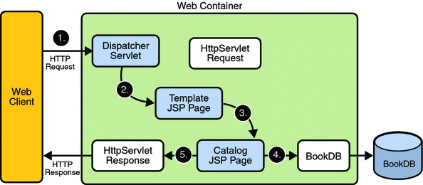

# Java Challenge Servlet

A simple example of a Java servlet.

## The Challenge

The challenge here is to create a Java servlet that parses XML that is fetched from the web, create a POJO from that XML, then create a JSON object out of that POJO and return it via the Servlet. You can find the XML at this URL:

``` https://www.w3schools.com/xml/plant_catalog.xml ```

The skeleton Servlet has already been set up for you, follow the `Running the Servlet` instructions below to get it running and test it out. 

Here is the challenge laid out in steps:

1. Read the XML and parse it into a Java POJO. An XML SAX parser has already been added to the project via Maven. Feel free to Google information on SAX parsers if you are not familiar with them. 

2. Change the newly created POJO into a JSON array of objects. The `org.json` package is being imported into the project via Maven. You are free to google it if you are not familiar with it.

3. Return the newly created JSON array to the user via the servlet.

### Requirements

1. Please do not simply transform the XML directly to JSON. POJOs must be used.


## Servlets

Java servlets are compiled Java classes that implement all or part of a web application. They are not standalone Java programs but must be run by a suitable web server.  Though this might seem complicated it actually makes creating and deploying web based applications easier.



## Running the servlet

To run the servlet build the war file, then deploy using Jetty or Tomcat.

To build the servlet we build the ```package``` target using Maven.  From the command line the command is -

```mvn package```

Which will compile and then package.

Or you could select this from the ```Maven Projects``` in VS Code `Explorer` view.

There are many ways test and run servlets, here are some suggestions.

1. As a Maven build.

    The ``Jetty plugin`` is included in this example's ```pom.xml``` enabling Jetty to be installed and started automatically via Maven.  
    
    * Use this command:

        ```mvn jetty:run```

    For more information see https://www.eclipse.org/jetty/documentation/9.4.x/maven-and-jetty.html 

1. From the command line.

   * Download Jetty from http://www.eclipse.org/jetty/download.html

   * Unzip the downloaded file

   * Copy the WAR file into the ``webapps`` folder

   * In the ``jetty-distribution`` folder, start Jetty with the command

   ```java -jar start.jar```

   * Open the webpage http://localhost:8080

   For more information see
   http://www.eclipse.org/jetty/documentation/9.4.x/quickstart-running-jetty.html


1. Using the VS Code Jetty extension.

    * Install the ``Jetty for Java`` extension. (Reload to enable)

    * Add a Jetty server, select the folder you unzipped to

    * Click right on the .war file in the VS Code Explorer view, 
    choose ```Run on Jetty Server``` 

1. Using Tomcat.

Tomcat includes a web interface for managing the web server. You can use this to upload WAR files into the server, and other configuration tasks.  You might also wish to install the ``Tomcat for Java`` VS Code extension.


